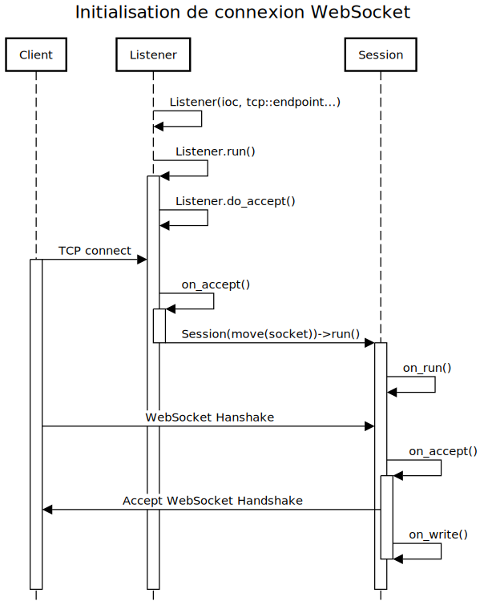

= Spécification de l'architecure du serveur C++
Léo Chéneau <leo.cheneau@etu.unistra.fr>
v1.0, 2020-01-28
:toc:
:toclevels: 4

<<<

## Technologies

Le serveur {cpp} devra compiler sous *gcc 8.x*, c'est à dire la version de gcc par défaut sous *Raspbian 8.3*. +
En conséquence le standard {cpp} utilisé sera *{cpp}17*.

Le code devra compiler sous Raspbian et donc être compilable vers une plateforme *ARM v8 64-bit*.

Les bibliothèques utilisées seront :

* *Boost _1.67_* pour les WebSocket et le réseau ainsi que les tests. +
(dernière version Raspbian)

* La *STL* pour *_TOUT_* _le reste_.

La compilation sera simplifiée grâce à *CMake _3.13.4_* et les tests unitaires seront supervisés par CTest et codés avec *Boost::Test*.

<<<

## Structure de fichiers

Les fichiers seront partagés selon une hiérarchie spécifique :

* _include/_ : fichiers .hpp
* _src/_ : fichiers .cpp
* _bin/_ : exécutables finaux
* _obj/_ : .o temporaires
* _doc/_ : documentation et spécifications
* _lib/_ : Librairie statiques et dynamiques
* *_tests/_* : tests unitaires .cpp

On se réserve le droit de faire des sous-dossiers pour les include si nécessaire.

## Tests

Afin de simplifier le debug et de confirmer qu'un bout de code correspond bien à la spec chaque fonction sera testée à part dans des *tests unitaires* et on utilisera une approche _TDD_.

Il est vraiment important d'être exhaustifs afin de gagner du temps plus tard sur la phase de debug.

Il faudra aussi proposer des *tests d'intégration* avec des faux clients !

<<<

## Architecture

### Tour d'horizon

Le serveur sera découpé en plusieurs modules distincts :

- *Module réseau* : Il s'occupera de dispatcher les paquets aux fonctions logiques associées.

- *Module logique* : Il s'occupera de gérer le déroulement d'une partie.

- *Module BDD* : Il s'occupera des communications avec le SGBD.

- *Module JWT* : Il s'occupera de vérifier les JWT.

Dans les faits il y aura une hiérarchie de classes associée, voir plus bas.

### Parallélisme & Threads

Afin d'assurer une qualité de service optimale la gestion des I/O sera asynchrone et multi-threads.

Le nombre de threads sera fixé à l'exécution.

TIP: Voir https://www.boost.org/doc/libs/develop/libs/beast/example/websocket/server/async/websocket_server_async.cpp[exemple de serveur WebSocket de Boost]

<<<

### Module réseau
#### Listener

Un seul et unique *Listener* sera créé, son rôle sera d'accepter les connexions TCP de manière asynchrone et de transférer leur ownership à une *Session*.

##### Interface

TIP: Voir https://www.boost.org/doc/libs/develop/libs/beast/example/websocket/server/async/websocket_server_async.cpp[Exemple de Boost]

* *Listener*(_net::io_context&_ ioc, _tcp::endpoint_ endpoint) : Crée le listener
* *run*() : Commence à accepter les connexions.
* *do_accept*() : Accepte la prochaine connexion de manière asynchrone via callback.
* *on_accept*(_beast::error_code_ ec, _tcp::socket_ socket) : Callback créant une session.

#### Session

Une session sera crée pour chaque client.

La session sera chargée des opérations E/S bas-niveau avec le client qui lui est attribué de manière asynchrone.

À toute session sera liée à un *Dispatcher* et ce dernier pourra changer au cours de l'exécution.

##### Interface

TIP: Voir https://www.boost.org/doc/libs/develop/libs/beast/example/websocket/server/async/websocket_server_async.cpp[Exemple de Boost]

* *Session*(_tcp::socket&&_ socket, std::unique_ptr<Dispatcher>&& dispatcher) : Crée une session WebSocket à partir d'un socket TCP déjà accepté et l'associe à un dispatcher.
* *run*() : Démarre le mode asynchrone via callback.
* *on_run*() : Initialise la connexion WebSocket et effectue le _Handshake_.
* *on_accept*() : Autorise la lecture de message si le Handshake est accepté.
* *do_read*() : Met en place le callback de lecture.
* *on_read*(_beast::error_code_ ec, _std::size_t_ bytes_transferred)) : Callback appelé à la réception d'un message. Désérialize le code et appelle le Dispatcher.
* *unserialize*() : Désérialize le message WebSocket et appelle dispatch du Dispatcher courant.
* *do_write*() : Écrit le contenu courant du buffer dans le socket de manière asynchrone.
* *on_write*() : Envoie le buffer sur le réseau.
* *change_dispatcher*(std::unique_ptr<Dispatcher>&& dispatcher) : change le dispatcher courant.

##### Fonctions annexes

Pour simplifier l'envoi de message on disposera de deux fonctions :

* *send_message*(_Session const&_ session, _T&&_ param1, _Args&&..._ params) : Envoie un message WebSocket avec les arguments passés en paramètre.

* *send_error*(_Session const&_ session, _uint8_t_ subcode, _std::string const&_ str) : Envoie une erreur avec le code d'erreur 0, le sous-code passé en paramètre et le message d'erreur.

* *broadcast*(_Lobby const&_ lobby, _T&&_ param1, _Args&&..._ params) : broadcast un message à tout un salon.

<<<

#### Dispatcher

Tous les paquets réseau seront traité par un *Dispatcher* qui sera construit à partir d'*une table associative* de correspondance entre _code de message_ et _fonction callback_.
Le dispatcher recevra un message, le désérializera, et appellera la _fonction de callback_ avec les paramètres désérializés.

Pour simplifier l'implémentation on utilisera un héritage avec plusieurs classes héritant de *Dispatcher* :

* *LobbyPoolDispatcher* : Dispatcher associé à une LobbyPool.
* *PoolDispatcher* : Dispatcher associé à _UN_ salon en particulier.
* *GameDispatcher* : Dispatcher associé à _UNE_ partie en particulier.

Chaque Dispatcher est lié à une *Session* et un objet logique, il change au cours du temps :

NOTE: *Dispatcher* sera donc une classe abstraite.

##### Interface

* *dispatch*(uint8_t code, Session& session,  beast::flat_buffer& buffer) : dispatch les arguments reçus à la bonne fonction logique.

#### Fonction de dispatch

Une fonction de dispatch devra : +
* *_Désérializer les arguments_* depuis le reste du message. (Fait par la fonction générique) +
* *_Appeler_* la fonction logique associée. +
* *_Envoyer un/les message(s)_* associé(s).

IMPORTANT: Un Dispatcher n'est pas responsable de son objet logique !

#### Responsabilités

.Code de messages gérés
[cols=3]
|===
|*Dispatcher* 2+|*Codes pouvant être reçus*
|LobbyPoolDispatcher|0x10|0x12
|PoolDispatcher|0x15|0x20
|GameDispatcher 2+|_TOUT LE RESTE_
|===

<<<

#### Réception d'un message

<<<

### Module Logique

#### Gestion des erreurs

Par mesure de sécurité *on testera tous les paramètres* en entrée et que toutes les actions demandées sont conformes à la logique du jeu Risk.

Si jamais un argument est erroné ou bien si une action est invalide c'est le rôle de ce module de le signaler.

Ce signalement se fera via l'émission d'une *exception* qui sera rattrapée par le Module réseau.

#### Exceptions

**Toute erreur** de logique sera gérée via des exceptions du type *LogicException*.

Ces exceptions hériteront de `std::exception` (duh) et contiendront un attribut *code* supplémentaire correspondant au sous-code d'erreur associé.

Ces exceptions devront pouvoir être sérializées au xref:messages.adoc#Erreurs[format de message d'erreur] via l'opérateur << 

Ces exceptions seront construites à partir du sous-code d'erreur et d'une message.

TIP: link:https://en.cppreference.com/w/cpp/error/exception[Voir la doc de std::exception]

##### Interface

* *LogicException*(_uint8_t_ subcode, _std::string const&_ what) : Crée une LogicException +
* *what*() -> _const char*_ : Renvoie le message. +
* *subcode*() -> _uint8_t_ : Renvoie le sous-code d'erreur.

#### Exemple

.Exemple de création
****
[source, cpp]
----
if(/*une erreur de logique*/)
{
	throw LogicException{0x/*sous-code d'erreur*/, "Un message expliquant l'erreur"};
}
----
****

<<<

#### LobbyPool

Tous les salons seront gérés par une classe *LobbyPool* qui sera liée automatiquement à une *Session* via un *Dispatcher* approprié à la création de cette dernière.

Une seule instance de cette classe sera créé au début du programme.

Elle s'occupera de : +
* *_Créer les salons_* sur demande +
* *_Transmettre les paramètres_* de partie avant lancement. +
* *_Accepter des joueurs_* dans un salon existant si ce dernier dispose de l'ID. +
* *_Détruire les salon vides_*.

Pour cela elle s'appuiera sur une table associative ID -> *Lobby*.

Une fois une partie lancée, les sessions seront attribuées à un *Dispatcher* associé à une *Game*. +
À la fin d'une partie les joueurs actifs rejoindront le même *Lobby* afin de pouvoir recommencer une partie.

IMPORTANT: *LobbyPool* ne vérifie pas les JWT, ou l'origine des demandes. Il ne désérialize pas non plus les messages. +
C'est le rôle de son Dispatcher et sa fonction associée !

La *Session* doit être gardée en mémoire par *Pool* pour pouvoir faire des _broadcast_ à tout le salon, c'est un peu moche...

#### Interface

Afin d'assurer ces fonctions on disposera des fonctions :

* *LobbyPool*(_size_t_ max_lobbies) : crée une nouvelle poule avec un nombre de salon maximal.

* *create_lobby*(_Session&_ session, _std::string const&_ gamertag, _GameParameters const&_ params) -> _Lobby&_ : crée un nouveau salon associé à une session. +
Renvoie l'ID du salon.

* *join_lobby*(_lobby_id_t_ lid, _Session&_ session, _std::string const&_ gamertag) : Le joueur rejoint un lobby existant.

* *_private_* *destroy_lobby*(_lobby_id_t__ lid) : détruit un lobby. Seul le Lobby lui même peut appeller cette fonction.

WARNING: Il faut penser à garder un lien vers le LobbyPool dans le Lobby pour pouvoir appeller *destroy_lobby*

NOTE: Le *Dispatcher* des sockets est changé si une de ces fonctions réussit. +
voir plus bas <<Lobby, pour un exemple>>

<<<

#### Lobby

La classe *Lobby* est un salon individuel créé sur mesure par *LobbyPool* et qui implémente les différentes opérations.

Il stocke son _lobby_t_, la liste des joueurs, c'est à dire leur _gamertag_ et leur *Session*. +
Il stocke aussi la liste des joueurs bannis.

Lorsqu'une partie est lancée l'état *started* est mis à _true_ et une partie est mise dans le _std::optional<Game>_.

Son interface comprend la fonction *join* correspondante à la fonction éponyme de *LobbyPool* avec le _lobby_id_t_ en moins, mais aussi :

* *ban*(_Session const&_ origine, _std::string const&_ gamertag) : Origine banni un joueur du lobby.

* *exit*(_std::string const&_ gamertag) : le joueur quitte le lobby.

NOTE: * Si le maître quitte un joueur prend sa place. +
* Si le salon est vide, il est détruit.

* *start_game*(_Session const&_ origine) -> _Game&_ : Lance une partie. +

WARNING: Il faut créer les *Dispatcher* associés aux parties individuelles et salons !

[source, cpp]
----
Game game(/*...*/);
session.change_dispatcher(std::make_unique<GameDispatcher>(game);
----

<<<

#### Game

C'est la classe responsable de gérer une partie, elle est créée à partir des paramètres de parties à chaque fois qu'on lance une nouvelle partie.

C'est ici que sont implémentées les règles du jeu.

##### Interface

* *Game*(_GameParameters const&_ params, Lobby const& lobby) : Crée une partie avec certains paramètres et un Lobby.

* *add_troops*(_uint16_t_ dest_square, _uint16_t_ nb_troops) : Place des troupes sur une case.

* *attack*(_uint16_t_ src_square, _uint16_t_ dst_square, _uint16_t_ nb_troops) -> _struct atk_result_ : Attaque une case depuis une autre. +
Retourne une structure *atk_result* contenant le résultat de l'attaque.

* *transfer*(_uint16_t_ src_square, _uint16_t_ dst_square, _uint16_t_ nb_troops) : Transfert des troupes.

* *skip*() : Termine la phase actuelle.

* *is_finshed*() -> bool : Indique si une partie est terminée.

* *player_quit*(_std::string const&_ gamertag) : Le joueur a quitté la partie.

WARNING: On doit penser au cas où le joueur quitte la partie et penser à le kick du *Lobby*.

#### GameParameters

On utilisera une structure *GameParameters* pour stocker les paramètres de la partie avant de la lancer.

On pourra changer : +
* *_Le nombre de joueurs_*, via `nb_player` +
* *_L'ID de la map_*, via `id_map` +
* *_Temps d'un tour (secondes)_* via `sec_by_turn`

NOTE: Afin d'augmenter l'abstraction ça peut être intéressant de faire une classe ou fonction de parsing à part et détachée qui s'occupe de convertir la représentation physique d'une map en données logiques.

IMPORTANT: voir link:specif_stockage_cartes.adoc[spécification d'une carte]

#### Sérialization

La sérialization (pour envoyer les informations d'initialisation aux joueurs) se fera via la *surcharge d'opérateur <<* et _friend_.

NOTE: Pour plus d'informations sur la sérialization d'une partie, voir le xref:messages.adoc#démarrer-une-partie[message 0x21].

<<<

### Module BDD

Le module BDD devra pouvoir enregistrer une partie terminée.

IMPORTANT: Le serveur doit penser à vérifier si un joueur est banni même si son JWT est valide !

Toutes les fonctions de BDD seront regroupées dans un http://www.vishalchovatiya.com/singleton-design-pattern-in-modern-cpp/[Singleton] : *DBMS*.

Le module devra fournir les fonctionnalités suivantes : +
* *_Vérifier_* si un joueur peut rejoindre une partie. +
* *_Ajouter_* une partie terminée. +
* *_Bannir_* un joueur. +

NOTE: On utilisera la librairie https://www.sqlapi.com/[SQLAPI{pp}]

#### Concurrence

WARNING: Dû à la nature hautement parallèle du serveur il faudra penser et faire attention aux accès concurrents.

#### Interface

Pour cela il fournira l'interface :

* *get*() : Récupère l'instance de la classe.

* *can_join*(_std::string const&_ gamertag) -> bool : Teste si un joueur peut rejoindre un lobby.

* *ban*(_std::string const&_ gamertag, _std::string const&_ reason) : Banni un joueur.

NOTE: Comme spécifié, un joueur sera banni 1 jour pour sa première tentative de triche, puis indéfiniment.

* *add_game*(_Game const&_ game) : Ajoute une partie terminée à la BDD.

NOTE: Il faudra peut-être faire des accesseurs, ou utiliser l'amitié.

<<<

### Module JWT

Le module *JWT* sera similaire au module BDD dans le sens où il sera aussi basé sur un http://www.vishalchovatiya.com/singleton-design-pattern-in-modern-cpp/[Singleton] du nom de *JWT*.

Il fournira les services suivants : +
* *_Vérifier_* qu'un JWT. +
* *_Désérializer_* un JWT si il est valide. +

#### Interface

Pour cela il fournira l'interface suivante :

* *get*() : récupère l'instance de la classe.

* *verify*(_std::string const&_ jwt) -> _bool_ : Vérifie qu'un JWT est valide, c'est à dire correctement signé.

* *decode*(_std::string const&_ jwt) -> _JWT_t_ : Désérialize un JWT valide et renvoie une structure associée.

##### JWT_t

Un *JWT_t* sera une structure représentant le contenu d'un JWT comme spécifié dans https://tools.ietf.org/html/rfc7519[RFC 7519]

Il contiendra :

* *iss* : Le _nom de l'émetteur_. (risk.zefresk.com)

* *sub* : L'_uid_ du joueur.

* *name* : le _gamertag_ du joueur.

* *iat* : la _date d'émission_ du JWT.

* *exp* : la _date d'expiration_ du JWT.

* *nbf* : _Date de début de validité_ (= iat)

* *jti* : _Nombre aléatoire_ sur 64 bits.

NOTE: On utilisera la librairie https://github.com/arun11299/cpp-jwt[cpp-jwt]
