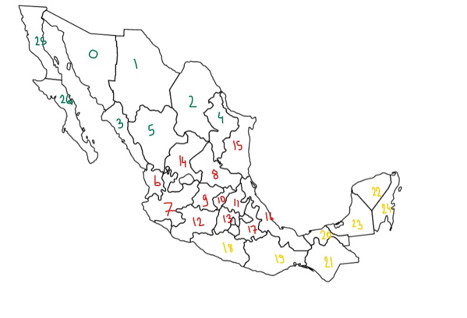

= Specification du stockage des cartes
Karim BOUALI <karim.bouali@etu.unistra.fr>
v3.1, 02/03/2020

:toc:

== Representation logique des cartes

=== Idee

NOTE: Une carte est un ensemble de regions, une region est un ensemble de territoires.

Soit :

* T, le nombre de territoires de la carte.
* R, le nombre de regions de la carte.

Une carte sera reprensentee par une matrice d'incidence M de taille T*T, pour specifier les liens entre les territoires. Ainsi que R tableaux specifiant l'appartenance d'un territoire a une region.

Ces donnees seront stockees dans un fichier texte.

Avec ce fichier texte on aura les informations suivantes :

* le nom de la carte
* le nombre de territoire
* le nombre de region
* le nom de chacune des regions
* la valeur de chacune des regions
* a quelle region appartient chaque territoire
* les liens entre chaque territoire

=== Explication

Chaque region et chaque territoire de la carte auront un identifiant i qui leur sera prealablement defini.

*concernant la matrice d'incidence :*

A la ligne i de la matrice on retrouvera les valeurs des liens entre le territoire d'identifiant i avec les autres territoires.

* Si Mi,j = 0, alors le territoire d'identifiant i n'a pas de lien avec le territoire d'identifiant j.
* Si Mi,j = 1, alors le territoire d'identifiant i est lié avec le territoire d'identifiant j.

WARNING: i et j commencent a 0.

WARNING: Mi,j = {0, 1}.

*concernant les tableaux d'appartenance :*

Il y aura R tableaux, un par region. Les elements du tableau seront les identifiants des territoires appartenant a cette region.

=== Format du fichier 

Pour une carte avec T territoires et R regions :

* 1er ligne : le nom de la carte.
* 2eme ligne : nombre de territoires de la carte 
* 3eme ligne : nombre de regions de la carte.
* R lignes suivantes : valeur des regions (valeur de la region 0 a la ligne 3 + *1*, valeur de la region 1 a la ligne 3 + *2* ...)
* R lignes suivantes : tableaux d'appartenance pour chacune des regions par ordre d'identifiant des regions. (tableau d'appartenance pour la region 0 a la ligne 3 + R + *1* du fichier, tableau d'appartenance pour la region 1 a la ligne 3 + R + *2* du fichier...)
* R lignes suivantes : noms de chacunes des region par ordre de leur identifiant.
* T lignes suivantes : valeurs de la matrice d'incidence.

=== Exemple

source de la carte : https://www.amcharts.com/svg-maps/?map=france2016

Pour cette carte on a prealablement defini les identifiants de chaque regions et de chaque territoires, et les liens entre les regions sont en vert. On a egalement prealablement definis la valeur de chaque region.
Ainsi le fichier correspondant sera le suivant :

.Exemple carte de France
----
carte de France
9
4
2
2
1
0 2
1 3
4 6 5
7 8
nom region 0
nom region 1
nom region 2
nom region 3
0 1 1 1 0 0 0 0 0
1 0 0 1 0 0 0 0 0
1 0 0 1 1 0 1 0 0
1 1 1 0 0 1 1 0 0
0 0 1 0 0 0 1 1 0
0 0 0 1 0 0 1 0 0
0 0 1 1 1 1 0 1 0
0 0 0 0 1 0 1 0 1
0 0 0 0 0 0 0 1 0
----

D'apres la 1er ligne du fichier on comprend qu'on a ici le stockage de la carte "carte de France". On lit aussi que la carte possede 9 territoires et 4 regions.
La valeur de la region 0 et 1 valent 2 et la derniere 1.
La region d'identifiant 0 est composee des territoires 0 et 2, la region d'identifiant 1 des territoires 1 et 3... Le nom de la region d'identifiant 0 est "nom region 0"...

Concernant la lecture de la matrice d'incidence si on prend sa 2eme ligne on a:
----
1 0 0 1 0 0 0 0 0
----

On voit que la 1ere et 4eme valeurs sont egales a 1 et les autres a 0, ce qui signifie que le territoire d'identifiant 1 est relie au territoire d'identifiant 0 et 3. 

== Representation graphique des cartes

Les cartes seront au format svg pour faciliter la manipulation des differents territoires. En svg chaque forme est representee par une balise, ainsi on pourra ajouter l'attribut `id` pour y mettre la valeur l'identifiant du territoire prealablement defini et l'attribut `class` pour le nom de la region.

=== Exemple 

Voici une carte en license domaine publique recuperee a l'adresse : https://publicdomainvectors.org/fr/gratuitement-des-vecteurs/Carte-politique-de-graphiques-vectoriels-Mexique/6063.html .

Ici en vert sont numerotes les territoires de la region 0, en rouge les territoires de la region 1, en jaune les territoires de la region 2.

TIP: Certains territoires sont volontairement pas numerotes car je les ai enlevé du code source de l'image du fait de leur petite taille qui peut causer des problemes d'accessibilité.

Version simplifiee du code source de l'image svg :

----
<svg>
    <polyline id="0" class="north mexico" points="11.96 3.75 27.65 ... />
    <polyline id="1" class="north mexico" points="1.9 31.5 7.5 ... />
    ...
    <polyline id="15" class="center mexico" points="9.3 1.45 17.2 ... />
    ...
    <polyline id="19" class="south mexico" points="7.8 3.5 9.5 ... />
    ...
</svg>
----

La balise `<polyline id="15" class="center mexico" points="9.3 1.45 17.2 ... />` definit la forme du territoire d'identifiant 15 sur la carte qui appartient a la region 1. Donc on lui donne comme id `15` et comme class `center mexico`.

NOTE: Voir le  link:src_carte_mexique.svg[code source de l'image] et sa link:rep_logique_carte_mexique.txt[representation logique].

== Rangement des fichiers

L'image d'une carte svg ainsi que le fichier de sa representation logique porteront le meme nom, à l'exception de l'extension `.svg` pour l'image.
Le nom d'un fichier sera l'identifiant' de la carte qu'il represente. 

La structure sera donc la suivante :
----
map/
├─ 1 
├─ 1.svg
├─ 2
└─ 2.svg
----
